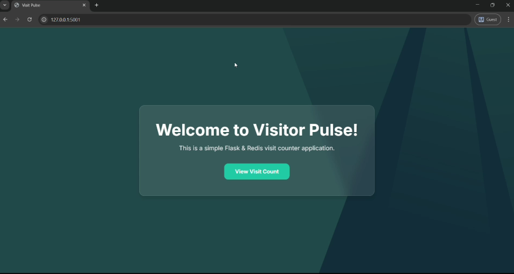
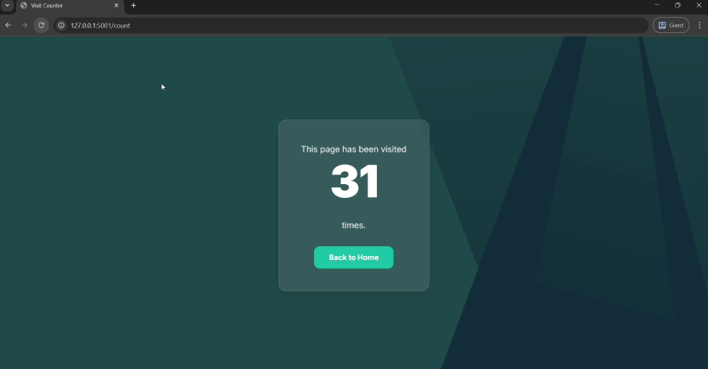

# 🐳 Flask + Redis Multi-Container App

This project is a multi-container web application built with **Flask** and **Redis**, managed via **Docker Compose**. The app displays a welcome message and keeps track of visit counts using Redis as a key-value store.

---

## 📦 Features

- Python Flask web server
- Redis for storing visit count
- Multi-container setup using Docker Compose
- Persistent Redis data via Docker volumes
- Environment-based configuration via `docker-compose.yml`

---

## 🚀 Getting Started

### ✅ Prerequisites

- Docker
- Docker Compose

### 🧰 Run the Application

docker compose up --build

Access the app at: http://localhost:5001

Visit the /count endpoint to increment and display the visit count

### ⚖️ Scaling the Application

This application is configured to be scalable. You can run multiple instances of the Flask application and use Nginx to distribute incoming traffic among them.

The expose directive in the docker-compose.yml file makes the Flask service's port 5001 available to other services within the Docker network, but not directly to your host machine. The Nginx service, acting as a reverse proxy, provides a single point of access by listening on port 5001 and forwarding requests to the available Flask instances.

To scale the Flask service to three instances for example, you can use the following command:

docker-compose up --scale flask=3

## Screen

