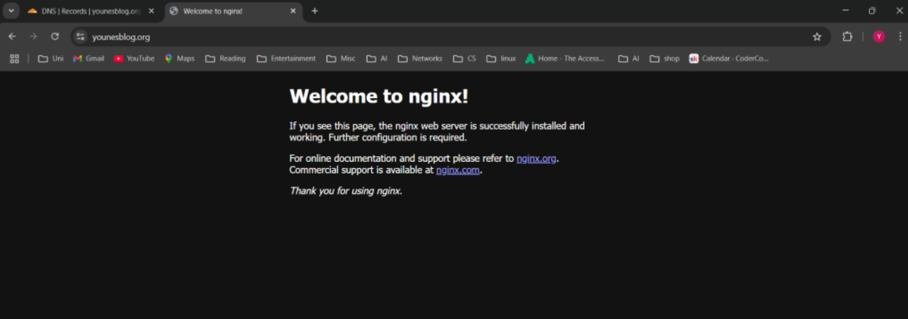

# 🌐 Nginx Project

## 🚀 What is Nginx?
Nginx is an **open-source web server** and **reverse proxy**.  
It handles incoming HTTP requests and forwards them to the correct backend service.  
It can also act as a **load balancer**, **cache**, or **security layer**.  

Think of it as a **web traffic officer** that directs and optimizes requests.  

---

## ⚙️ EC2 Setup
When creating the EC2 instance:
- Enable **Auto-assign public IP**
- Allow **port 80 (HTTP)** in the security group
- Use a **key pair** for SSH access
- Choose a clear **EC2 name** for easy identification

SSH permissions must be restricted:  
```bash
chmod 400 my-key.pem
📦 Install & Manage Nginx

# Update system
sudo yum update -y

# Install nginx
sudo yum install nginx -y

# Check version
nginx -v

# Start nginx
sudo systemctl enable nginx
sudo systemctl start nginx
sudo systemctl status nginx

# Stop nginx
sudo systemctl stop nginx
Verify Nginx is running:

curl localhost:80
cat /etc/nginx/nginx.conf
🌍 Domain & DNS Setup
Using Cloudflare DNS:

Add an A record pointing your domain (@) to the EC2 public IPv4.

Add a CNAME record:

Name: www

Target: @ (root domain)

Cloudflare proxies A records by default (extra security).

🔐 SSL Certificate with Certbot
Install dependencies:

sudo yum install -y epel-release
sudo yum install -y certbot python3-certbot-nginx
Update Nginx config /etc/nginx/nginx.conf with a server block:

server {
    listen 80;
    server_name younesblog.org www.younesblog.org;

    root /usr/share/nginx/html;
    index index.html;

    location / {
        try_files $uri $uri/ =404;
    }
}
Request and apply SSL certificate:

sudo certbot --nginx -d younesblog.org -d www.younesblog.org
Once successful, your site is both secure (HTTPS) and connected to your domain.

📸 Screenshot



🧾 Commands Used

sudo su
yum update
yum install nginx
systemctl start nginx
systemctl stop nginx
⚠️ Note: Running as root (sudo su) is not best practice.
It’s better to use sudo on a per-command basis for security.